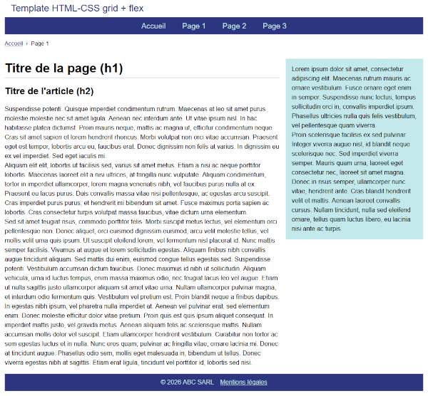

# Template HTML/CSS Responsive grid + flex 

> 📆 17/02/2026

## ✅ Points implémentés

* Reset CSS : marges, `box-sizing: border-box;` hauteur 100%, hauteur de ligne à 1.5.
* Mobile-first : 
  * les règles de styles sont écrites d'abord pour l'affichage sur un écran de smartphone (petits écrans ～320 pixels). 
  * Une media query gère les écrans plus larges (ici > à 1025 pixels).   
  * Menu mobile dépliable/repliable (géré avec un peu de JavaScript).
  * Colonne droite masquée en mobile (`display: none`)
* CSS 100% natif, donc sans framework (type Bootstrap etc.). 
* Structure globale (zonage) gérée avec CSS Grid. Agencement interne des zones via Flex. 
* Page centrée, largeur fixe de 1100 pixels (hauteur dynamique).
* Barre de navigation principale incluse dans la balise `<header>` (bonne pratique).
* Utilisation d'une balise `<aside>` pour la colonne de droite, si l'on considère que son contenu est indirectement lié à celui de la page. Si  le contenu de la colonne n'a aucun lien avec celui de la page, il convient de remplacer `<aside>` par une balise `
`. 
* Feuille de style pour l'impression écoresponsable.

## 🟠 Points non implémentés

* Externalisation, minification et préchargement des feuilles de styles et du fichier Javascript.
* Accessibilité non auditée (mais prévu).
* Quelques soucis de débordement (overflow) à inspecter , mais aucun scroll horizontal.

